# **Assignment 3: Branching Strategies & Merge Conflicts**

## **Objective**
 Experience working with branches and resolving conflicts.

## **Tasks**

### **1.Create a new repository implementing GitHub Flow:**
We can create a new Repository in our GitHub Account by pressing new Repository button and also add a README.md file for better Flexibility.
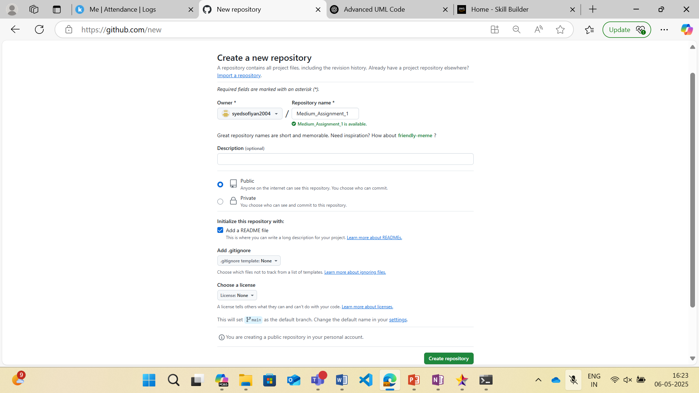
As we can see the repository has been Created in the name of "Medium_Assigment_1":
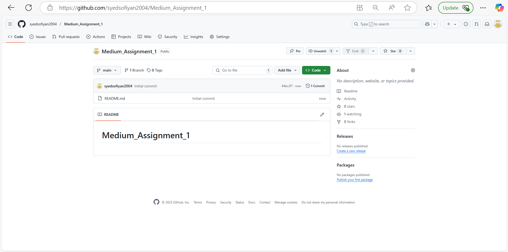
Now we can create a folder in our Local Machine named "Assignment 3" and Initialized an empty repository type this command:
```sh
git init
```
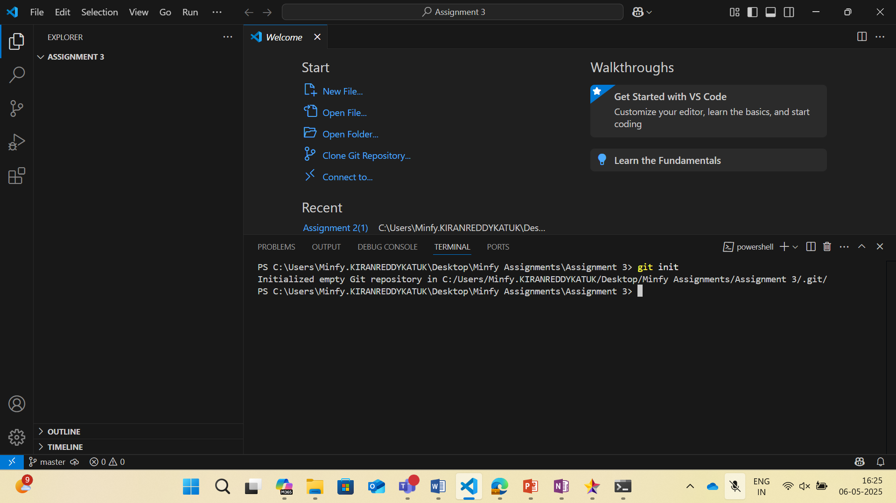
Then Pull the created Repository into your Local machine by typing this command:

```sh
git pull https://github.com/syedsofiyan2004/Medium_Assignment_1
```
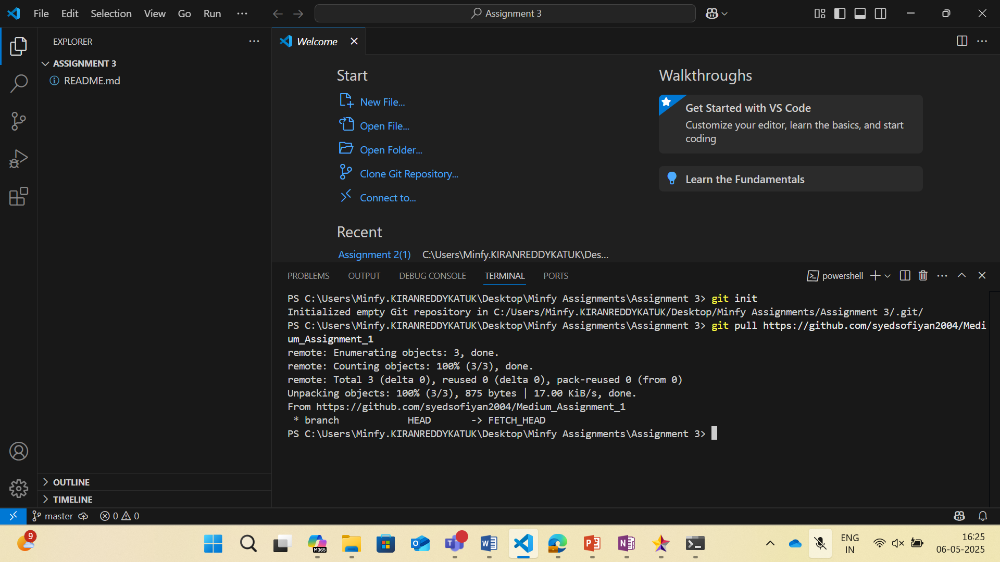

### **2.Create a simple web page with HTML/CSS or a script in your preferred language/ technology:**
So let's create a simple HTML file and also add some CSS styles in it:
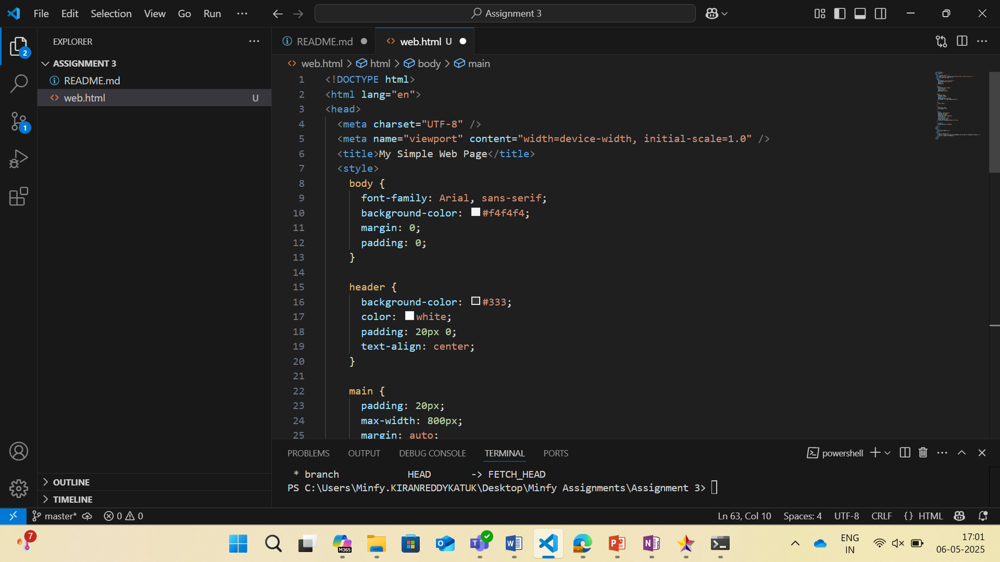

### **3.Create two feature branches from main: 	
**Branch A: "feature/update-styling" - Update styling or formatting Branch B: "feature/add-content" - Add new content**
We have to create two new branches with the names as mentioned, we can create those branches by typing the following commands:
```sh
git branch feature/update-styling
git branch feature/add-content
```
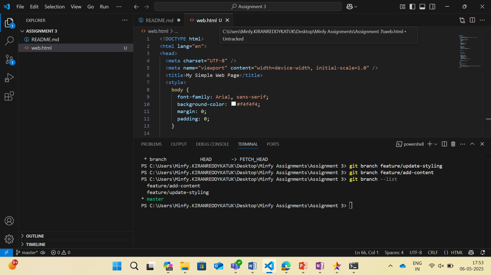
As we can see from the image that we have created both the branches successfully 

### **4.Make commits to both branches, ensuring they modify the same files in different ways:"**
We can add the changes in these branches accordingly and then commit it let's make a change in styling so checkout to the feature/update-styling branch:
```sh
git checkout feature/update-styling
```
The changes in the files has been done and then the commit is perfomed in the following way:
```sh
git commit -m "update Styling"
git commit -m "Added Content"
```
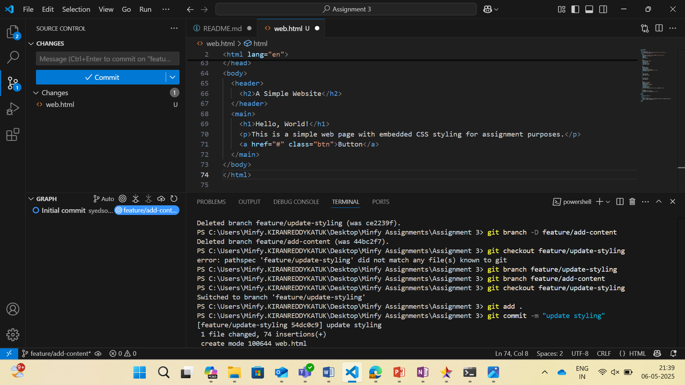
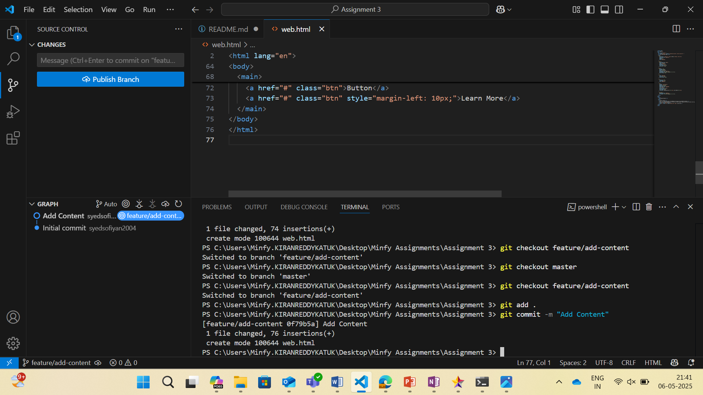
as we can see in the images we have successfully commited now we have to push the branches into GitHub.
```sh
git push origin feature/update-styling
git push origin feature/add-content
```
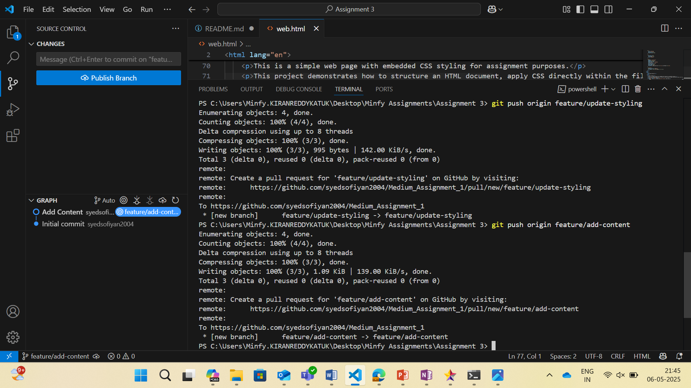
as we can see in the image we have successfully pushed the repository in the GitHub
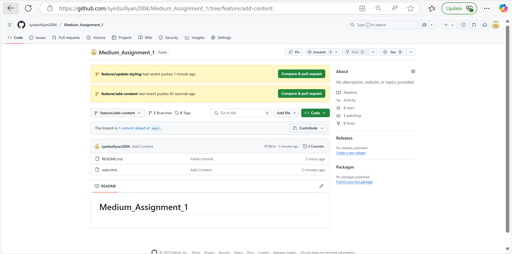

### **5.Create pull requests for both branches:**
Now after successfull push of repository we can call pull requests manually in the GitHub interface as shown in the figure:
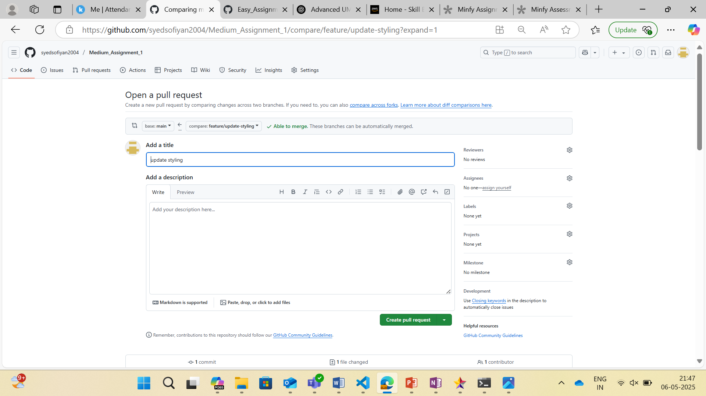

### **6.Merge one branch first:**
As we can see we have pull requests with 0 conflicts as there is no change now it shows successfully merged.
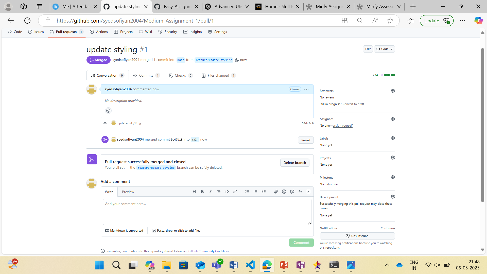
Now lets try another branch pull request
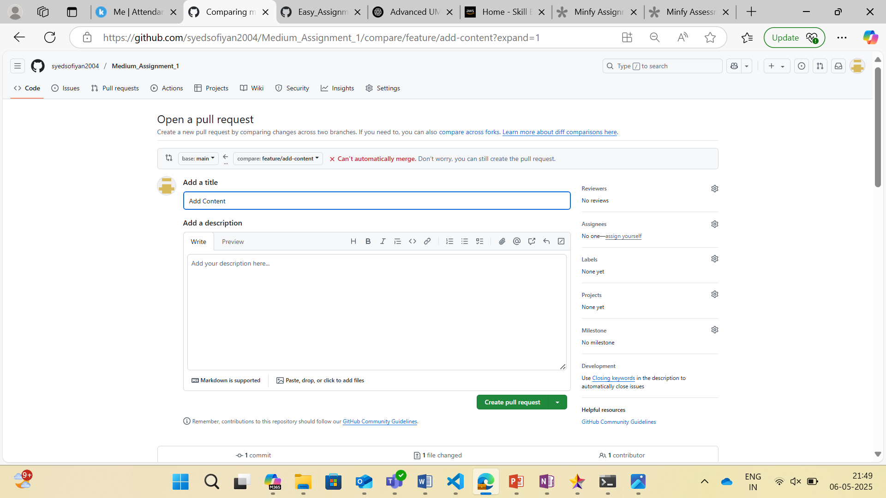

### **7.Experience and resolve the merge conflict with the second branch:**
As we can see we can pull request but cant merge as there is a Merge Conflict here so we need to resolve it.
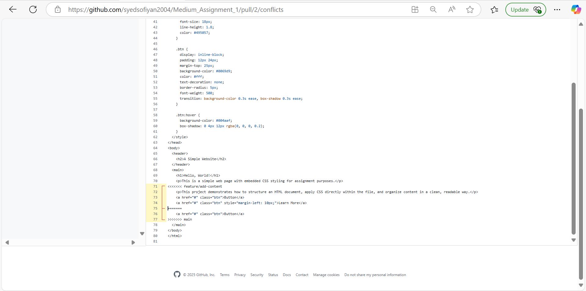
As we can see in the image we are resolving a Merge conflict here after resolving the merge conflict we can successfully merge it to the main branch.

### **8.Successfully merge both changes:**
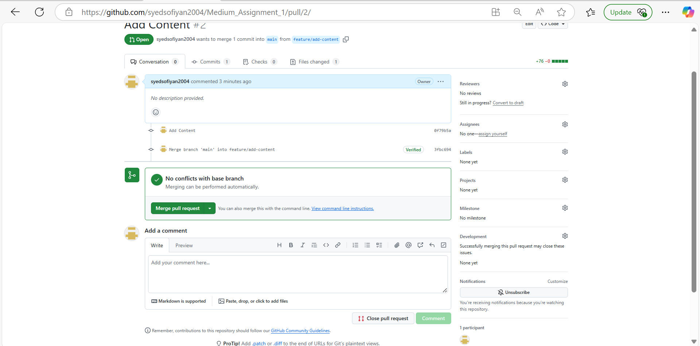
As we can see we have merge pull request after pressing it our branch is merged and the merge conflict have been resolved.
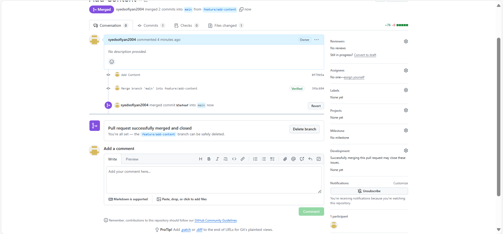
We have successfully resolve the Merge Conflict and we have our repositories correctly.
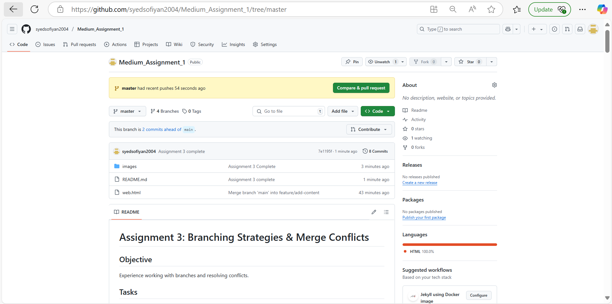

## Graph of the Assignment 3:
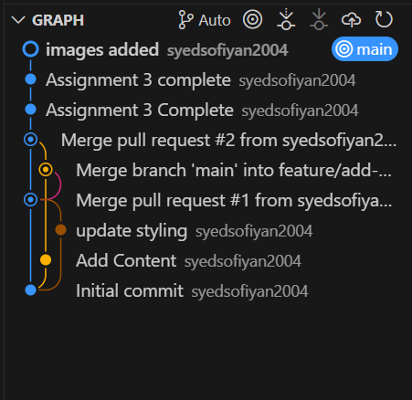


### Our Website Image:
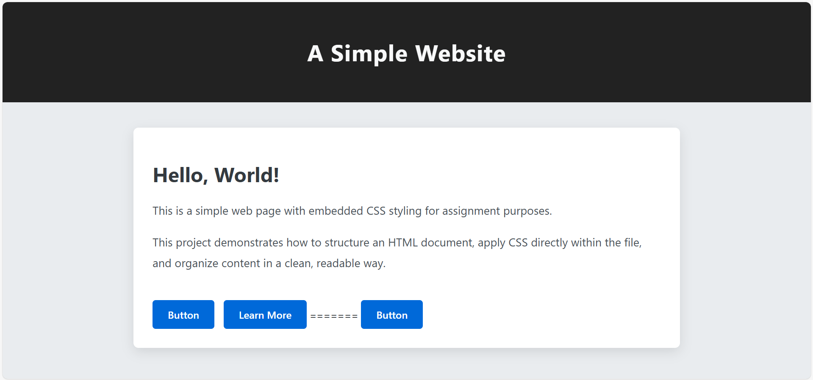

## Assigment 3 Completed! 
